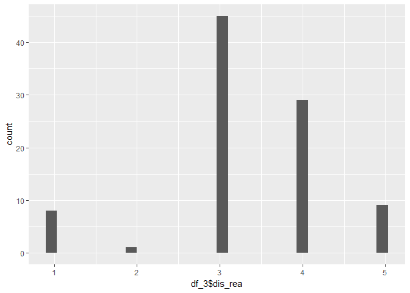
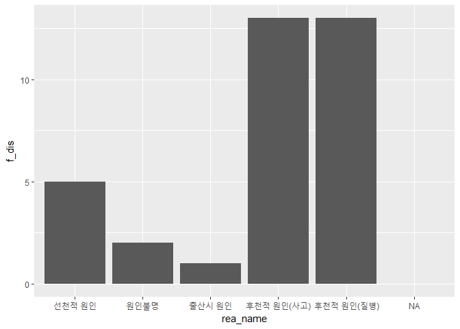
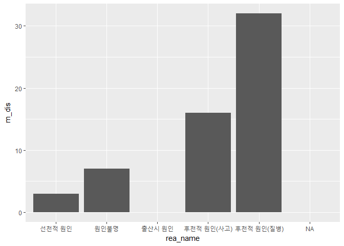
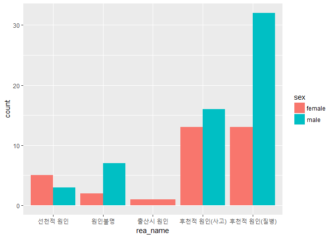
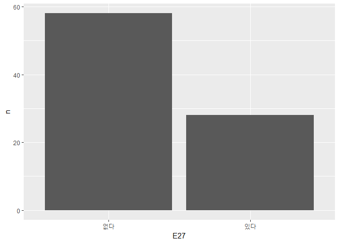
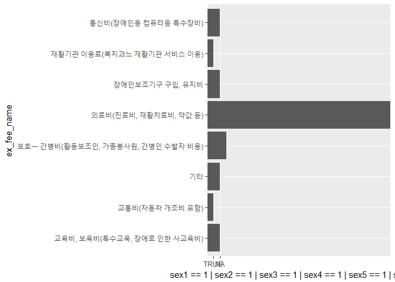
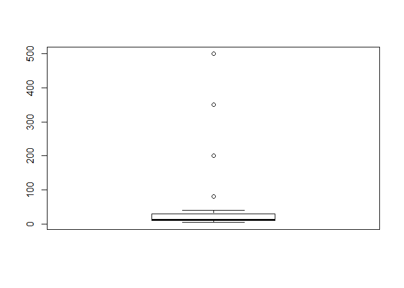
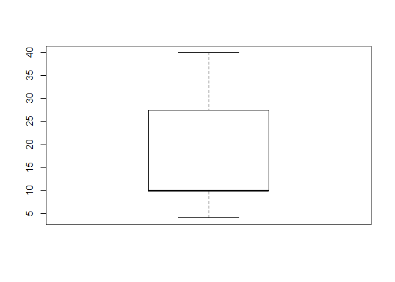

Seoul\_disabled\_people
================
60140680 권용우

성별에 따른 장애원인 및 추가비용 차이 연구
==========================================

요약
----

통계조사에 사용된 3019가구에서 집계된 총 가구원의 수는 7452명이었으며 그 중 각기 다른 변수로 묶인 장애 가구원들의 개별적인 **성비**와 **장애원인**을 따로 분류한 다음**rbind**를 사용하여 묶어서 데이터 프레임화 하여서 조사하였다. 전체 장애인의 수는 남성이 많았고 남성과 여성 모두 가장 큰 장애원인은 후천적 질병으로 인한 것으로 조사되었다. 그러나 여성의 경우 출산으로 인한 장애가 발생한다는 점과 선천적 장애의 비율이 남성에 비해 높았다는 점에서 차이가 있었다. 또한 장애로인한 비용발생의 원인을 조사한 결과에서는 남녀모두 의료비 지출로 인한 비용이 월등히 높았다. 이에 따라 남녀간 장애발생 요인에는 유의미한 차이가 존재하지만 장애로 인한 추가지출에는 남녀 모두 큰 차이가 없다는 사실을 알 수 있었다.

분석 주제
---------

서울시복지실태조사 데이터를 통해서, 장애 가구원들의 성별과 이에 따른 장애요인의 차이가 있는지를 조사하고, 성별의 차이로 인한 추가비용발생의 차이가 있는지를 조사하였다.

### 문제의식

남성과 여성의 장애원인의 차이는 최근 중요하게 논의되고 있는 예방적 사회복지 구성에 중요한 나침반이 될 수 있다. 따라서 성별 차이에 따른 장애원인을 조사하는 것을 통해 앞으로 우리 정부가 이뤄가야 할 사회 안전망의 범주 설정에 도움을 줄 수 있을 것이다. 또한 지금 장애를 가진 가구들의 의견을 취합하여 정말 장애인 가구들이 필요로 하는 복지정책을 시행할 수 있을 것이다.

### 분석데이터

분석데이터는 2015년 서울시에서 조사한 [**2015\_서울복지실태조사\_데이터**](http://data.si.re.kr/sisurvey2015er17)를 사용한다.

### 데이터 선정 이유

서울시에서 조사한 복지 페널데이터로서 복지에 관한 전체적 인식설문 조사와 연구가 체계적으로 되어 있었기 때문에 이번 조사 이후에도 추가적인 조사와 후속 연구를 진행하기 좋은 데이터라고 판단하였기 때문에 이 데이터를 선정하였다.

분석 과정
---------

#### 분석에 필요한 패키지 설치

``` r
library(ggplot2)      # 시각화
library(readxl)       # 엑셀 파일 불러오기
library(dplyr)        # 전처리
```

    ## 
    ## Attaching package: 'dplyr'

    ## The following objects are masked from 'package:stats':
    ## 
    ##     filter, lag

    ## The following objects are masked from 'package:base':
    ## 
    ##     intersect, setdiff, setequal, union

데이터는 위에서 설명한 2015 서울복지실태조사 데이터를 사용한다.

#### 데이터 확인

``` r
#데이터 불러오기
raw_df <- read_excel("2015_서울복지실태조사_데이터.xlsx") 

# 복사본 만들기
df <- raw_df                                           
```

``` r
# 데이터 확인
str(df)       
head(df)
tail(df)
summary(df)

#결측치 확인 
table(!is.na(df))

#분석결과 생략
```

먼저 설문에 참여한 총 가구원들의 성별과 장애여부, 장애원인을 뜻하는 변수를 쉬운이름으로 바꾼다. 데이터의 특성 상 열은 개별 가구를 뜻하고, 일부 행은 개별 가구의 가구원을 뜻한다. 우리는 개별적인 가구원들의 성별과 장애유무, 장애 원인을 알고자 하기 때문에 현재의 데이터 형태와 다른 개별적인 데이터 형태를 구축하는 것이 비교하기 더욱 편하다.

하지만 그러기에 앞서 기존 데이터는 변수명이 코드로 되어 있기 때문에 코드명을 알아야 하는데, 이는 \*[http://data.si.re.kr/sisurvey2015er17\*에서](http://data.si.re.kr/sisurvey2015er17*에서) 원자료와 같이 코드북을 받을 수 있다.

``` r
df <- rename(df, 
             sex1 = A1_3_1, # 가구원 별 성별
             sex2 = A1_3_2,
             sex3 = A1_3_3,
             sex4 = A1_3_4,
             sex5 = A1_3_5,
             sex6 = A1_3_6,
             sex7 = A1_3_7,
             sex8 = A1_3_8,
             sex9 = A1_3_9,
             sex10 = A1_3_10)

df <- rename(df,
             dis_p1 = C1_6_1, # 가구원 별 장애여부
             dis_p2 = C1_6_2,
             dis_p3 = C1_6_3,
             dis_p4 = C1_6_4,
             dis_p5 = C1_6_5,
             dis_p6 = C1_6_6,
             dis_p7 = C1_6_7,
             dis_p8 = C1_6_8,
             dis_p9 = C1_6_9,
             dis_p10 = C1_6_10)

df <- rename(df,
             dis_rea1 = C1_9_1, # 가구원 별 장애원인
             dis_rea2 = C1_9_2,
             dis_rea3 = C1_9_3,
             dis_rea4 = C1_9_4,
             dis_rea5 = C1_9_5,
             dis_rea6 = C1_9_6,
             dis_rea7 = C1_9_7,
             dis_rea8 = C1_9_8,
             dis_rea9 = C1_9_9,
             dis_rea10 = C1_9_10)
```

**rename**변수로, 처리된 변수들을 이용하여 새로운 데이터 형태로 데이터 프레임화를 진행했다.

``` r
a <- data.frame(sex = df$sex1) 
b <- data.frame(sex = df$sex2)
c <- data.frame(sex = df$sex3)
d <- data.frame(sex = df$sex4)
e <- data.frame(sex = df$sex5)
f <- data.frame(sex = df$sex6)
g <- data.frame(sex = df$sex7)
h <- data.frame(sex = df$sex8)
i <- data.frame(sex = df$sex9)
j <- data.frame(sex = df$sex10)

df_sex <- rbind(a,b,c,d,e,f,g,h,i,j) # rbind를 통해 데이터 가공

a <- data.frame(dis_p = df$dis_p1)
b <- data.frame(dis_p = df$dis_p2)
c <- data.frame(dis_p = df$dis_p3)
d <- data.frame(dis_p = df$dis_p4)
e <- data.frame(dis_p = df$dis_p5)
f <- data.frame(dis_p = df$dis_p6)
g <- data.frame(dis_p = df$dis_p7)
h <- data.frame(dis_p = df$dis_p8)
i <- data.frame(dis_p = df$dis_p9)
j <- data.frame(dis_p = df$dis_p10)

df_dis_p <- rbind(a,b,c,d,e,f,g,h,i,j)

a <- data.frame(dis_rea = df$dis_rea1)
b <- data.frame(dis_rea = df$dis_rea2)
c <- data.frame(dis_rea = df$dis_rea3)
d <- data.frame(dis_rea = df$dis_rea4)
e <- data.frame(dis_rea = df$dis_rea5)
f <- data.frame(dis_rea = df$dis_rea6)
g <- data.frame(dis_rea = df$dis_rea7)
h <- data.frame(dis_rea = df$dis_rea8)
i <- data.frame(dis_rea = df$dis_rea9)
j <- data.frame(dis_rea = df$dis_rea10)

df_dis_rea <- rbind(a,b,c,d,e,f,g,h,i,j)
```

위 진행과정을 설명하자면, a ~ j라는 임시적인 데이터 프레임을 만들어서 각 변수를 동일한 변수명으로 입력한 다음, **rbind**함수를 이용하여 데이터를 합쳤다. 나는 **rbind**를 사용했지만, **bind\_rows**함수를 이용해도 된다.

이제 가공된 데이터의 결측치와 이상치를 알아보자

``` r
#결측치 확인

table(!is.na(df_sex))
```

    ## 
    ## FALSE  TRUE 
    ## 22738  7452

``` r
table(!is.na(df_dis_p))
```

    ## 
    ## FALSE  TRUE 
    ## 22738  7452

``` r
table(!is.na(df_dis_rea))
```

    ## 
    ## FALSE  TRUE 
    ## 30098    92

``` r
#이상치 확인

table(df_sex)
```

    ## df_sex
    ##    1    2 
    ## 3492 3960

``` r
table(df_dis_p)
```

    ## df_dis_p
    ##    1    2 
    ##   92 7360

``` r
table(df_dis_rea)
```

    ## df_dis_rea
    ##  1  2  3  4  5 
    ##  8  1 45 29  9

분석 과정을 통해, 3019개의 가구 중에서 *조사에 참여한 가구원*이 **총 7452명**이라는 사실을 알 수 있었으며 그중 **남성은 3492명**, **여성 3960명**으로 집계되었다. 또한 7452명중 *장애를 가진 가구원*은 **92명**이었으며 장애원인으로는 순서대로 3,4,5,1,2 순으로 집계 되었다.

장애원인과 성별에 관해서는 코드북에 나와있다. 하지만 장애원인과 성별이 숫자로 표현되어 있어서 직관적으로 알아보기 힘드므로 다시한번 재가공을 하려한다.

``` r
df_1 <- data.frame(df_sex, df_dis_p,df_dis_rea) # 데이터 프레임화

df_1 <- df_1 %>% filter(!is.na(sex) & !is.na(dis_p)) %>% # 남자 장애인 변수 생성
  mutate(m_dis = ifelse(sex == 1 & dis_p == 1, 1, NA))
```

    ## Warning: package 'bindrcpp' was built under R version 3.4.4

``` r
df_1 <- df_1 %>% filter(!is.na(sex) & !is.na(dis_p)) %>% # 여자 장애인 변수 생ㅅ
  mutate(f_dis = ifelse(sex == 2 & dis_p == 1, 1, NA)) 
```

먼저 위의 세 가지 함수를 하나의 데이터 프레임으로 만든 다음, 좀 더 쉬운 데이터 가공을 위해서 m\_dis와 f\_dis를 만들어서 남녀 장애인을 구분할 수 있는 함수를 만들었다.

``` r
head(df_1) # 데이터 확인 
tail(df_1) 
str(df_1)
summary(df_1)

#출력 생략#
```

위에서 만든 **df\_1**데이터를 확인한 후, 이후 데이터의 성별과 장애원인에 ifelse와 merge 함수를 이용해서 재가공한다.

``` r
df_1$sex <- ifelse(df_1$sex == 1 , "male","female") # "ifelse" 함수 사용 - 성별 부여

# 장애원인의 이름이 들어간 데이터 생성
df_2 <- data.frame(dis_rea = c(1,2,3,4,5), 
                   rea_name = c("선천적 원인","출산시 원인","후천적 원인(질병)","후천적 원인(사고)","원인불명"))
```

``` r
str(df_2) # 데이터 확인
summary(df_2)
head(df_2)
tail(df_2)
```

``` r
df_3 <- merge( x = df_1,         # 데이터 결합 
               y = df_2,         
               by = 'dis_rea',   # "dis_rea"를 기준으로 데이터 가공
               all = TRUE)
```

``` r
str(df_3)           # 데이터 확인    
summary(df_3)
dim(df_3)
head(df_3)
tail(df_3)
```

``` r
df_3 %>% filter(!is.na(rea_name)) %>% 
  group_by(rea_name) %>% 
  summarise(n=n())
```

    ## # A tibble: 5 x 2
    ##   rea_name              n
    ##   <fct>             <int>
    ## 1 선천적 원인           8
    ## 2 원인불명              9
    ## 3 출산시 원인           1
    ## 4 후천적 원인(사고)    29
    ## 5 후천적 원인(질병)    45

``` r
df_3 %>% filter(!is.na(m_dis)) %>% 
  group_by(rea_name) %>% 
  summarise(count=n())
```

    ## # A tibble: 4 x 2
    ##   rea_name          count
    ##   <fct>             <int>
    ## 1 선천적 원인           3
    ## 2 원인불명              7
    ## 3 후천적 원인(사고)    16
    ## 4 후천적 원인(질병)    32

``` r
df_3 %>% filter(!is.na(f_dis)) %>% 
  group_by(rea_name) %>% 
  summarise(count = n())
```

    ## # A tibble: 5 x 2
    ##   rea_name          count
    ##   <fct>             <int>
    ## 1 선천적 원인           5
    ## 2 원인불명              2
    ## 3 출산시 원인           1
    ## 4 후천적 원인(사고)    13
    ## 5 후천적 원인(질병)    13

분석결과를 보기 쉽게하기위해, 표로 나타내면 이렇다.

``` r
qplot(df_3$dis_rea) 
```

    ## `stat_bin()` using `bins = 30`. Pick better value with `binwidth`.



``` r
# 전체 장애원인 집계

ggplot(data = df_3, aes(x = rea_name, y = f_dis)) + geom_col() 
```



``` r
# 여성 장애원인 집계

ggplot(data = df_3, aes(x = rea_name, y = m_dis)) + geom_col() 
```



``` r
# 남성 장애원인 집계
```

하지만 이렇게 만들면, 성별간 차이를 직관적으로 비교하기 어렵다. 따라서 두 그래프가 합쳐진 그래프를 그리려고 한다.

``` r
df_a <- df_3 %>% filter(!is.na(rea_name)) %>%  # 시각화용 데이터 재가공
  group_by(sex, rea_name) %>% 
  summarise(count=n())
```

``` r
str(df_a) 
```

    ## Classes 'grouped_df', 'tbl_df', 'tbl' and 'data.frame':  9 obs. of  3 variables:
    ##  $ sex     : chr  "female" "female" "female" "female" ...
    ##  $ rea_name: Factor w/ 5 levels "선천적 원인",..: 1 2 3 4 5 1 2 4 5
    ##  $ count   : int  5 2 1 13 13 3 7 16 32
    ##  - attr(*, "vars")= chr "sex"
    ##  - attr(*, "drop")= logi TRUE

``` r
summary(df_a)
```

    ##      sex                         rea_name     count      
    ##  Length:9           선천적 원인      :2   Min.   : 1.00  
    ##  Class :character   원인불명         :2   1st Qu.: 3.00  
    ##  Mode  :character   출산시 원인      :1   Median : 7.00  
    ##                     후천적 원인(사고):2   Mean   :10.22  
    ##                     후천적 원인(질병):2   3rd Qu.:13.00  
    ##                                           Max.   :32.00

``` r
# 생성된 데이터 확인
```

이렇게 재가공한 데이터를 이용하여 남녀가 같이 나오는 그래프를 그리면 아래와 같다

``` r
ggplot(data = df_a, aes(x = rea_name, y=count , fill = sex)) + 
  geom_col(position = "dodge")
```



``` r
#남녀 장애원인 비교 그래프 생성
```

비교결과 남성인 장애 가구원수가 여성에 비해 훨씬 높다는 것을 확인 할 수 있었으며, 장애의 주요 원인으로는 남녀 모두 **후천적 원인**이 높았다. 특히 남자의 경우 **후천적 질병**으로 인한 장애비율이 월등히 높았으며, 여성의 경우 신체적 차이로 인한 **출산시 원인**으로 인한 장애 발생이 있을 수 있다는 점도 주목할 만 하다.

또 다른 차이점으로는 남성에 비해 여성의 **선천적 원인**으로 인한 장애 비율이 높다는 것을 알 수 있었다.

그렇다면 성별에 따른 추가적인 비용에 차이가 있을까? E27 변수는 장애로 인해 추가비용이 발생하는지 묻는 변수이다.

``` r
                               # 추가비용 발생 데이터
df %>% filter(!is.na(E27)) %>%
  mutate(E27 = ifelse(E27 == 1, "있다", "없다")) %>% 
  group_by(E27) %>% 
  summarise(n=n()) %>% 
  arrange(n)
```

    ## # A tibble: 2 x 2
    ##   E27       n
    ##   <chr> <int>
    ## 1 있다     28
    ## 2 없다     58

총 86가구 중에 28가구가 장애로 인한 추가비용이 발생한다고 설문에 참여했다. 참고로 앞에 있는 장애 가구원의 수와 가구의 수가 다른 이유는, 한 가구의 2명 이상의 장애 가구원이 있는 경우가 있기 때문이다.

가구별 추가비용에 관한 그래프를 그려보면 이러하다.

``` r
                                       # 추가비용 데이터 생성
df_b <- df %>% filter(!is.na(E27)) %>% 
  mutate(E27 = ifelse(E27 == 1, "있다", "없다")) %>% 
  group_by(E27) %>% 
  summarise(n=n()) %>% 
  arrange(n)

ggplot(data = df_b, aes(x=E27, y=n)) + geom_col()      # 시각화
```



그렇다면 추가비용에 대한 남녀 차이가 존재할까?

sex1 ~ 10 변수에서 1의 값은 남자를 뜻한다.

``` r
df %>% filter(sex1 == 1|sex2 == 1 |sex3 == 1 |sex4 == 1|sex5 == 1 |sex6 == 1|sex7 == 1|sex8 == 1|sex9 == 1|sex10 == 1 , !is.na(E27)) %>% group_by(E27) %>% summarise(count=n())
```

    ## # A tibble: 2 x 2
    ##     E27 count
    ##   <dbl> <int>
    ## 1    1.    22
    ## 2    2.    51

sex1 ~ 10 변수에서 2의 값은 남자를 뜻한다.

``` r
df %>% filter(sex1 == 2|sex2 == 2|sex3 == 2|sex4 == 2|sex5 == 2|sex6 == 2|sex7 == 2|sex8 == 2|sex9 == 2|sex10 == 2, !is.na(E27)) %>% group_by(E27) %>% summarise(count=n())
```

    ## # A tibble: 2 x 2
    ##     E27 count
    ##   <dbl> <int>
    ## 1    1.    26
    ## 2    2.    50

남녀 장애 가구원이 같이 있는 가구가 있다는 가정하에도, 여성 장애 가구원이 있는 가구의 경우 더욱 많은 추가비용이 발생한다는 것을 알 수 있다.

그러면 추가비용이 많이 발생하는 항목은 무엇일까? E27\_2 변수는 장애로 인해 추가비용이 많이 들어가는 항목이다.

``` r
# 남성 장애인들 중 추가로 비용이 많이 들어가는 항목

df %>% 
  filter(sex1 == 1|sex2 == 1 |sex3 == 1 |sex4 == 1|sex5 == 1 |sex6 == 1|sex7 == 1|sex8 == 1|sex9 == 1|sex10 == 1 , !is.na(E27_2)) %>% 
  group_by(E27_2) %>% 
  summarise(count=n())
```

    ## # A tibble: 4 x 2
    ##   E27_2 count
    ##   <dbl> <int>
    ## 1    1.     1
    ## 2    2.    19
    ## 3    4.     1
    ## 4    5.     1

``` r
# 여성 장애인들 중 추가로 비용이 많이 들어가는 항목

df %>% 
  filter(sex1 == 2|sex2 == 2|sex3 == 2|sex4 == 2|sex5 == 2|sex6 == 2|sex7 == 2|sex8 == 2|sex9 == 2|sex10 == 2, !is.na(E27_2)) %>% 
  group_by(E27_2) %>% 
  summarise(count=n())
```

    ## # A tibble: 4 x 2
    ##   E27_2 count
    ##   <dbl> <int>
    ## 1    1.     1
    ## 2    2.    23
    ## 3    4.     1
    ## 4    5.     1

남녀 장애인 모두 비슷한 항목에 추가비용이 많이 발생한다는 것을 알 수 있다. 하지만 항목이 코드로 되어 있기 때문에 알아보기 힘들다. 위에서 했던 방법으로 항목별로 이름을 기입한다.

``` r
#이름 데이터 생성

df_c <- data.frame(E27_2 = c(1,2,3,4,5,6,7,8), 
                   ex_fee_name = c("교통비(자동차 개조비 포함)","의료비(진료비, 재활치료비, 약값 등)","교육비, 보육비(특수교욱, 장애로 인한 사교육비)","보호ㅡ 간병비(활동보조인, 가종봉사원, 간병인 수발자 비용)","재활기관 이용료(복지과느 재활기관 서비스 이용)","통신비(장애인용 컴퓨터등 특수장비)","장애인보조기구 구입, 유지비","기타"))

#데이터 재가공

df_d <- merge( x = df,
               y = df_c,
               by = 'E27_2',
               all = TRUE)

# 남성 장애인들 중 추가로 비용이 많이 들어가는 항목
df_d %>% 
  filter(sex1 == 1|sex2 == 1 |sex3 == 1 |sex4 == 1|sex5 == 1 |sex6 == 1|sex7 == 1|sex8 == 1|sex9 == 1|sex10 == 1 , !is.na(ex_fee_name)) %>% 
  group_by(ex_fee_name) %>% 
  summarise(count=n())
```

    ## # A tibble: 4 x 2
    ##   ex_fee_name                                               count
    ##   <fct>                                                     <int>
    ## 1 교통비(자동차 개조비 포함)                                    1
    ## 2 보호ㅡ 간병비(활동보조인, 가종봉사원, 간병인 수발자 비용)     1
    ## 3 의료비(진료비, 재활치료비, 약값 등)                          19
    ## 4 재활기관 이용료(복지과느 재활기관 서비스 이용)                1

``` r
# 여성 장애인들 중 추가로 비용이 많이 들어가는 항목
df_d %>% 
  filter(sex1 == 2|sex2 == 2|sex3 == 2|sex4 == 2|sex5 == 2|sex6 == 2|sex7 == 2|sex8 == 2|sex9 == 2|sex10 == 2, !is.na(ex_fee_name)) %>% 
  group_by(ex_fee_name) %>% 
  summarise(count=n())
```

    ## # A tibble: 4 x 2
    ##   ex_fee_name                                               count
    ##   <fct>                                                     <int>
    ## 1 교통비(자동차 개조비 포함)                                    1
    ## 2 보호ㅡ 간병비(활동보조인, 가종봉사원, 간병인 수발자 비용)     1
    ## 3 의료비(진료비, 재활치료비, 약값 등)                          23
    ## 4 재활기관 이용료(복지과느 재활기관 서비스 이용)                1

이를 그래프로 표현하면 이렇다.

``` r
# 결측치 제거
df_d <- df_d %>% filter(!is.na(ex_fee_name))

# 남성 장애인들 중 추가로 비용이 많이 들어가는 항목 시각화
ggplot(data = df_d, aes(x = ex_fee_name, y=sex1 == 1|sex2 == 1 |sex3 == 1 |sex4 == 1|sex5 == 1 |sex6 == 1|sex7 == 1|sex8 == 1|sex9 == 1|sex10 == 1)) + 
  geom_col()+
  coord_flip()
```



``` r
# 여성 장애인들 중 추가로 비용이 많이 들어가는 항목
ggplot(data = df_d, aes(x = ex_fee_name, y=sex1 == 2|sex2 == 2|sex3 == 2|sex4 == 2|sex5 == 2|sex6 == 2|sex7 == 2|sex8 == 2|sex9 == 2|sex10 == 2)) + 
  geom_col()+
  coord_flip()
```

 위 그래프를 통해 남녀 장애인 모두 비슷한 항목에 추가비용이 많이 발생한다는 것을 직관적으로 쉽게 알 수 있다.

추가적으로 장애로 인한 추가 비용이 발생하는 가정에서의 평균 추가비용은 다음과 같다

``` r
#데이터 전처리
dis_extra_fee <- df %>% filter(!is.na(E27_1))

# 상자 그림 
boxplot(dis_extra_fee$E27_1)
```

 위 그림을 보면 이상치가 존재한다는 것을 알 수 있다. 이상치를 제거하고 다시 상자그림을 그려보자면 다음과 같이 할 수 있다.

``` r
# 이상치 확인

boxplot(dis_extra_fee$E27_1)$stats
```


    ##      [,1]
    ## [1,]    4
    ## [2,]   10
    ## [3,]   11
    ## [4,]   30
    ## [5,]   40

``` r
#이상치 제거
dis_extra_fee$E27_1 <- ifelse(dis_extra_fee$E27_1 > 40 , NA , dis_extra_fee$E27_1)

#상자 그림 
boxplot(dis_extra_fee$E27_1)

boxplot(dis_extra_fee$E27_1)$stats
```



    ##      [,1]
    ## [1,]  4.0
    ## [2,] 10.0
    ## [3,] 10.0
    ## [4,] 27.5
    ## [5,] 40.0

이를 통하여 추가비용이 발생하는 장애가구의 평균 추가비용이 10만원 정도 발생한다는 것을 알 수 있었다.

결론
----

### 연구 종합

종합해보자면, 평균적으로 남성 장애인의 장애원인으로 **후천적 질병**으로 인한 장애가 가장 많았으며 여성 장애인의 경우 **후천적 사고**와 **질병**의 비율이 가장 많았으며 두 변인의 비율이 동일했다. 특이한 점으로는 남성의 장애원인 중에서 **원인불명**으로 인한 장애가 여성에 비해 월등히 높았으며, 여성의 경우 **선천적 원인**으로 인한 장애의 비율이 남성보다 높게 밝혀졌다.

또한 장애로 인한 추가비용을 연구한 결과를 종합하자면, 조사에 참여한 **전체 장애인의 수**는 **남성**이 많았지만, **추가비용이 든다**고 응답한 비율은 **여성 장애인이 더 많았다.** 하지만 추가 비용이 발생하는 항목에 대해서는 **의료비 항목**으로 양성 모두 동일하게 나타났다.

### 한계점

이번 조사는 성별에 따른 장애원인의 차이와 성별로 인한 추가비용을 알아봄으로서, 남성에 비해 여성이 더 많은 비용을 사용하고 있다는 것을 알았다. 하지만, 성별 차이로 인한 정확한 금액의 차이는 알 수 없었다. 따라서 성별의 차이가 얼마나 많은 추가비용을 발생하는지에 대한 후속 연구가 필요하다고 생각한다.

또한 전체적인 장애 가구의 비율이 너무나 적어서, 통계적 오류가 발생할 수 있으므로, 더욱 많은 장애 가구의 데이터를 이용하여 유의미한 결과물을 도출 할 수 있길 기대한다.

### 추후 연구

후속연구로 성별 차이로 인해 현재의 복지 서비스 이용에 차이는 없는지, 혹은 성별로 인해 중점적으로 생각하는 복지서비스의 방향에 대해서 차이가 있는지 연구함으로서 정부가 개인별 시민에게 알맞는 복지서비스를 제공하는데에 많은 도움을 제공할 수 있길 기대한다.
